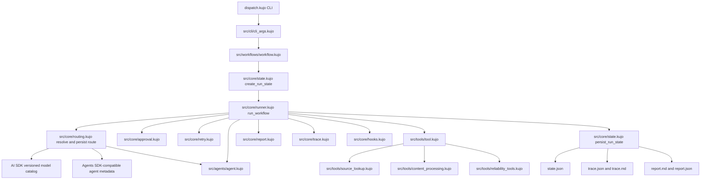
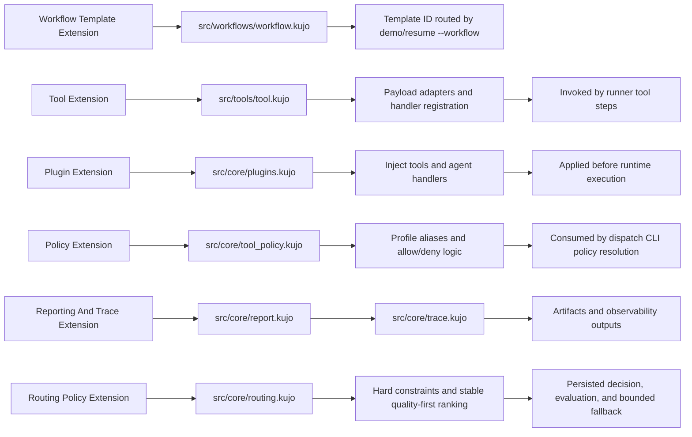

# Dispatch Architecture And Extension Diagrams

This document provides visual diagrams for runtime flow and extension surfaces.

## Runtime Flow

## Extension Points

## Notes

- The default execution path uses `src/` modules.
- CLI commands in `dispatch.kujo` are the integration boundary for workflow runtime, policy controls, and artifact lifecycle.
- Routing is opt-in and backward compatible. Dispatch owns decisions, AI SDK owns the versioned model catalog, and Agents SDK supplies the shared agent metadata vocabulary.
- A resumed step reuses its persisted route and fails explicitly when its catalog, route, execution handler, or plugin is no longer available.
