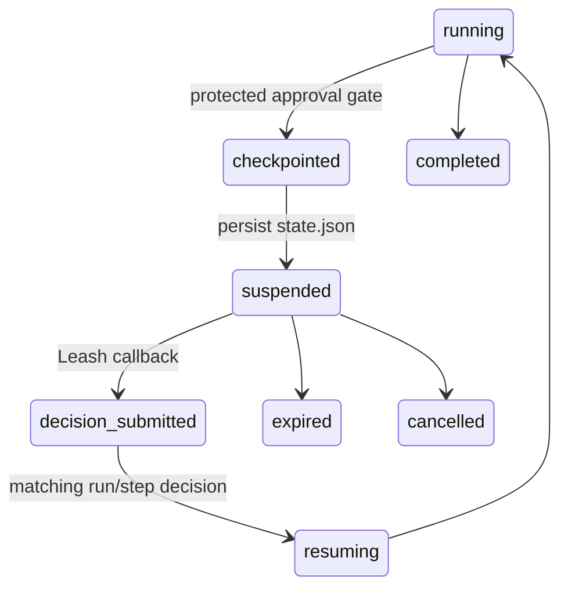

# Dispatch and Leash ChatOps integration

Dispatch owns the workflow state; Leash owns remote operator interaction. An
approval gate is checkpointed before Dispatch emits its provider-neutral
`human_intervention_required` event. The event contains the run, workflow, and
step binding, safe evidence references, allowed actions, and the Leash callback
metadata. Slack and Discord adapters never receive Dispatch internals.



The checkpoint is `state.json` plus `trace.json`. `run_workflow` returns
immediately after the paused approval step; no later step or model call is
started. A process may exit and `resume <run-id>` reloads the same state. The
current local CLI uses `--decision approve|reject|changes` and `--note` for
manual resume. A Leash deployment should point `--leash-url` at an authenticated
bridge that submits the normalized decision and invokes that same resume path.

## Local proof

```bash
export DISPATCH_OFFLINE_FIXTURE=true
export DISPATCH_ALLOWED_WEBHOOK_ORIGINS=http://127.0.0.1:9191
export DISPATCH_WEBHOOK_SIGNING_KEY=local-demo-key
export DISPATCH_ALLOW_INSECURE_LOCAL_WEBHOOK=true
export KUJO_ALLOW_PRIVATE_NETWORK_DESTINATIONS=1
WORK=tests/tmp/leash-dispatch
rm -rf "$WORK"
kujo run dispatch.kujo demo "ChatOps gate" --non-interactive \
  --output-root "$WORK" --leash-url http://127.0.0.1:9191/v1/intervention-events

RID=$(kujo run dispatch.kujo runs --output-root "$WORK" --status paused --json \
  | python3 -c 'import json,sys; print(json.load(sys.stdin)["runs"][0]["run_id"])')
kujo run dispatch.kujo resume "$RID" --yes --non-interactive --output-root "$WORK"
```

The paused state includes `human_intervention` and a stable event/decision
binding. The first resume transitions the gate; a second resume sees the
completed state and does not re-run completed work. The fixture path avoids
model calls and is the deterministic token-idle regression path.

## Compatibility and delivery

Existing `--webhook-sink` lifecycle behavior is unchanged. Network `--webhook-url` and `--leash-url` delivery requires an exact origin allowlist and HMAC signing key.
`--leash-url` is additive and only sends the intervention contract. Delivery
failure is not allowed to discard a paused state; the local sink and Dispatch
artifacts remain the source of truth.
