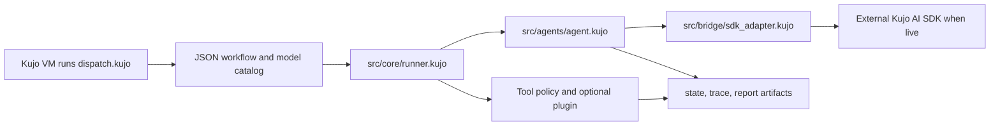

# Your first Dispatch workflow

Dispatch is written in [Kujo](https://github.com/kujolang/kujo). This tour uses
its bytecode VM and local fixture model, so it needs no provider key or network
request. Run each command from the Dispatch repository root after installing
Kujo (minimum version in `kennel.toml`).

```bash
export DISPATCH_OFFLINE_FIXTURE=true
kujo run dispatch.kujo validate --workflow-file examples/workflows/routed-review.json --json
kujo run dispatch.kujo explain-route --workflow-file examples/workflows/routed-review.json --step-id plan --json
kujo run dispatch.kujo demo "What makes a reliable workflow?" \
  --workflow-file examples/workflows/routed-review.json \
  --yes --non-interactive --output-root tests/tmp/first-workflow
kujo run dispatch.kujo runs --output-root tests/tmp/first-workflow --json
```

The demo prints a `Run ID`. Substitute that ID in the next command:

```bash
kujo run dispatch.kujo inspect <run-id> --output-root tests/tmp/first-workflow --json
```

Inspect `tests/tmp/first-workflow/<run-id>/trace.md` for the step-by-step
timeline, `trace.json` for machine-readable events, `state.json` for the
resumable state, and `report.md` for the output. The `plan` step uses a fixture
model from a versioned catalog; the `finalize` step writes the report. Neither
this demo nor its green checks establish live-provider readiness.

## Add a tool without changing the runner

The second workflow is intentionally small: `examples/workflows/plugin-echo.json`
declares `echo_tool`, the built-in `sample` plugin provides its handler, and
the CLI allowlist grants only that named tool. Plugins are trusted executable
code; review one before loading it from another source.

```bash
kujo run dispatch.kujo demo "Kujo extension example" \
  --workflow-file examples/workflows/plugin-echo.json \
  --plugin sample --allow-tools echo_tool \
  --yes --non-interactive --output-root tests/tmp/plugin-echo
```

The trace shows the `echo` tool step completing before the report. Removing
`--plugin sample` leaves the declared tool unavailable; changing the allowlist
to exclude `echo_tool` denies it. Both are visible failures, not silent
fallbacks. The handler and payload adapter are in
`src/plugins/builtin_plugins.kujo`; the policy builder is in
`src/core/tool_policy.kujo`.



Next: [author a workflow](../examples/quickstart-walkthrough.md), inspect
[architecture and extension points](architecture-and-extension-diagrams.md),
and read [enterprise deployment boundaries](enterprise-deployment.md) before
enabling live providers.
